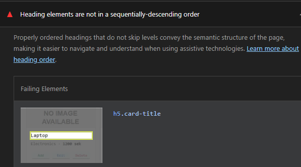
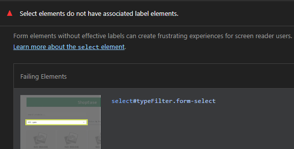
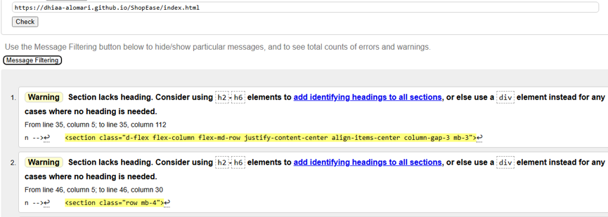
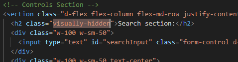
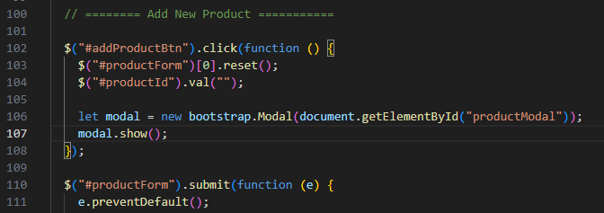

# <mark>ShopEase</mark>
ShopEase is a user-friendly e-commerce platform that lets customers browse, discover, and purchase products with ease.

**Link to visit website**
[ShopEase](https://dhiaa-alomari.github.io/ShopEase/index.html)
 
The project deployed on Github Pages.

## I am Responsive
*  On most devices it is responsive.
 

## Languages

* HTML
* CSS
* JavaScript

## Technology and Library Used
Technologies and libraries used in this project:

* JQuery
* Bootstrap

---
## Screenshots
This JS project contents two pages [Home page / Cart pgae]
  Below Screenshots for the website on desktop and mobile:
### <u>Desktop</u>
1.  Home page:
 

      

2. Cart page:
 

 

### <u>Mobile</u>
1.  Home page:
 

      

2. Cart page:
 

 

## Wireframe
###   <u>Desktop Design:</u>
1. Home Page:
 

 
2. Cart page:
 

 

###  <u>Mobile Design:</u>
1.  Home page:
 

 
2.  Cart page:
 

 
      
## CSS, HTML and JS codes has tested
*  All the codes in the project are tested in service **<u>[W3C HTML Validator](https://validator.w3.org/)</u>** , **<u>[W3C CSS Validator](https://jigsaw.w3.org/)</u>** and **<u>www.site24x7.com</u>**

###  <u>HTML files tested:</u>
1.  index.html:
 

 
2.  cart.html:
 

 

###  <u>CSS files tested :</u>
1.  style.css:
 

 

###  <u>JS files tested :</u>
1.  index.js:
 

 
2.  cart.js:
 

 

### <u>Website tested at Lighthouse in Chrome browser:</u>
 
| Performance | Accessibility | Best Prctice | SEO |
  

## User Stories

E-Commerce User Stories (Simplified)
These User Stories define the functional requirements for a simple e-commerce website selling Electronics, Fashion, and Accessories, focusing on browsing, cart management, and anonymous checkout.

### 1. Product Browsing and Discovery Stories
These stories aim to help visitors easily find what they are looking for and discover new products.

User Story, Target Audience(All Users)
"As a shopper, I want to filter products by category (Electronics, Fashion, Accessories) and sub-category (e.g., Laptops, Shirts, Necklaces), so that I can quickly narrow down my choices."
"As a savvy buyer, I want to sort the product listings by price (low to high), rating, and newest arrivals, so that I can find the best value or the latest items first."
"As a confused buyer, I want to see high-quality photos from multiple angles and a detailed description for each product, so that I can evaluate its features and quality before committing to purchase."
"As a user looking for deals, I want to see a clear indication of sales or discounts on the product page, so that I know I am getting a good price."

### 2. Shopping Cart Stories (Cart Management)
These stories focus on the functionality of adding and managing products within the shopping cart.

User Story, Target Audience(All Users)
"As a customer, I want to add a product to my cart directly from the product listing page or the detailed page, so that I can save it for later purchase."
"As a frequent shopper, I want to see a mini-cart summary (item count and total price) updated in the header/navigation bar, so that I can always keep track of my order without leaving the current page."
"As a hesitant buyer, I want to be able to change the quantity of items or remove items from the cart page easily, so that I can adjust my order before checkout."

### 3. Checkout Process Stories (Anonymous Payment)
These stories cover the process of finalizing the order and securely making a payment without requiring account creation.

User Story, Target Audience(All Users)
"As a user, I want to be able to checkout as a Guest (without creating an account), so that I can complete my purchase quickly without friction."
"As a paying customer, I want to select from multiple secure payment methods (e.g., Credit Card, PayPal), so that I can use my preferred and trusted method.",
"As a customer, I want to review my order details (products, shipping fees, total cost) on a final confirmation screen, so that I can ensure everything is correct before submitting payment."
"As a concerned buyer, I want to receive an order confirmation email immediately after payment, so that I have proof of my purchase and an order tracking number."

##  Debug
### 1.  <u>Heading elements are not in a sequentially-descending order</U>

This warning get from Ligthouse tool in Google Chrome Browser for optimizing search engine accessibility.
Remove <h5> element and change it with 
 elemnet for fixing the warning in Lighthouse tool.

Before Debug:
 

 

 
After Debug:

### 2.  <u>Select element without label</U>

This warning get from Ligthouse tool in Google Chrome Browser for optimizing search engine accessibility.
To fix the Lighthouse warning, use the aria-label attribute on the <select> element as an alternative to a visible <label> element.

Before Debug:
 

 
After Debug:

### 3.  <u>Section HTML element not content a heading element</U>

This warning get from W3C HTML Validator.
To fix this warning, you have to put heading HTML element like <h1> or <h2> into every section in your code and you can hide it if don not need it by css or give the heading element this class(invisible) or class(visually-hidden) if you use bootstrap in your project .
I added <h2> with Bootstrap class (visually-hidden) for hidding this element.

Before Debug:
 

 
After Debug:

### 4.  <u>Bootstrap Modal not showing</u>

When click on button (add new product) not showing Bootstrap modal.
Add bootstrap.Modal() to function that listen event on button (add new product).

After Debug:

##  Features

### General & Usability
* The application is fully responsive and optimized for display across a wide range of devices (e.g., mobile, tablet, and desktop).

* Users can search products by name.

* Users can filter products based on a price range.

* Users can filter products based on product category.

### Product Management (CRUD)
* The application supports full CRUD (Create, Read, Update, Delete) operations, allowing users/administrators to add, view, edit, and delete products.

### Shopping Cart System
* The web application includes a robust shopping cart system that allows users to save multiple products and proceed to the purchase/checkout process.

* The cart system includes the following specific features:

  * A real-time counter in the navigation bar displays the total number of items in the user's cart on the homepage (and all relevant pages).

  * The Checkout button is disabled when the cart is empty, preventing accidental clicks or errors.

  * Users can easily increase or decrease the quantity of the same product, or remove products from their cart.

  * The total price calculation is clear and accurate (trusted), reflecting all items and quantities in the cart.

### No Database or Backend
* This application is built without a backend or database; 
* It relies entirely on client-side Local Storage for data management.

## Deployment

### GitHub Pages

The site was deployed to GitHub pages. The steps to deploy are as follows: 
1. In the GitHub repository, navigate to the Settings tab 
2. From the left hand menu select 'Pages'
3. From the source select Branch: main
4. Click 'Save'
5. A live link will be displayed when published successfully. 

The live link can be found here - [ShopEase](https://dhiaa-alomari.github.io/ShopEase/)

### Forking the GitHub Repository

You can fork the repository by following these steps:
1. Go to the GitHub repository
1. Click on Fork button in upper right hand corner

### Cloning the GitHub Repository

You can clone the repository to use locally by following these steps:
1. Navigate to the GitHub Repository you want to clone
2. Click on the code drop down button
3. Click on HTTPS
4. Copy the repository link to the clipboard
5. Open your IDE of choice (git must be installed for the next steps)
6. Type git clone copied-git-url into the IDE terminal

The project will now be cloned locally for you to use.

##  Attributions

### Tips and tutorials
* [CodeInstitute](https://learn.codeinstitute.net/).
* [Bootstrap](https://getbootstrap.com/docs).
* [W3Schools](https://www.w3schools.com/js/).

### Wireframe design
* [proto.io](https://proto.io/).
* [icoconverter](https://www.icoconverter.com/) icon creator.

### Test my code
* [jigsaw.w3.org](https://jigsaw.w3.org/css-validator/) CSS tester.
* [validator.w3.org](https://validator.w3.org/) HTML tester.
* [www.site24x7.com/](https://www.site24x7.com/)  JavaScript tester.
* [amiresponsive](https://amiresponsive.co.uk/) Show web app on different screens.
* Lighthouse Tool in Google Chrome Browser as performance tester.

### Debugs and some instructions for coding
* Some bugs fixed and optimize my code by Chatgpt and Gemini.

### Inspiration
* This project's structure and frontend codebase, particularly the cart system logic, were inspired by and derived from a comprehensive jQuery and Bootstrap tutorial found on YouTube. 
* The scope was limited to the client-side implementation, excluding the backend portion.
* [Learn it with Muhindo](https://youtu.be/KWDq524ACgY?si=cL56Nz9I2XxlKDvj).
